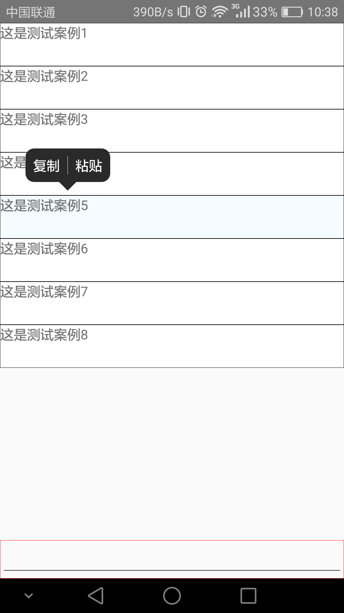

**使用如下：**

`<ToolTip 
       actions={[  
         {text: '复制', onPress:this._copy}, 
         {text: '粘贴', onPress: this._paste} 
       ]} 
       isCenter={false} 
       tipTop={this.state.tipTop} 
   />`

 

  <ul>
    <li>actions:为所需要处理的按钮事件</li>  
    <li>isCenter:为true时居于屏幕正中央，为false时需配合width属性一块使用（width为tooltip宽度，当按钮共四个字此属性可省略）</li>
    <li>tipTop:{isShow:false,top:0,left:0,sectionID:-1,data:{}}</li>
    <ul>
        <li>isShow:控制tooltip显示与隐藏</li>
        <li>top:tooltip距顶部距离</li>
        <li>left：tooltip据左边距离</li>
        <li>sectionID：控制选中组件样式变化</li>
        <li>data：选中组件数据</li>
    </ul>
  </ul>
  
  

 效果图：
   